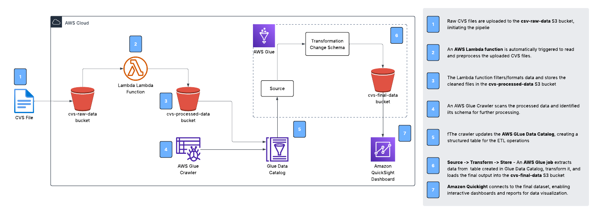
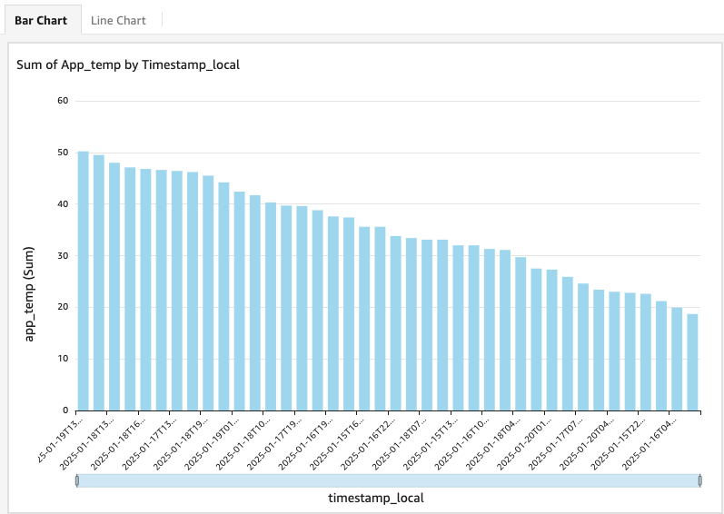
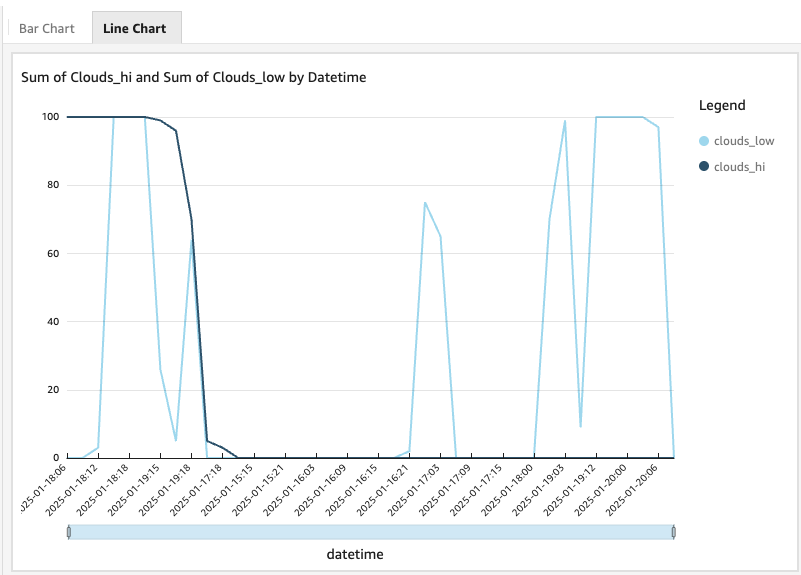

# CSV Data Pipeline

## 🌟 Overview

This project involves building a serverless data pipeline on AWS for processing CSV files. The pipeline automates the ingestion, transformation, and visualization of data. CSV files are uploaded to an raw data S3 bucket(csv-raw-data), triggering an AWS Lambda function to preprocess the data and store it in the processed data bucket(csv-processed-data) .

AWS Glue is then used for further ETL (Extract, Transform, Load) operations, and the final data is stored in final data bucket (csv-final-data). Finally, Amazon QuickSight is used to create interactive dashboards and reports for visualizing the final data.

* **Data Ingestion**: CSV files are uploaded to an Amazon S3 bucket, which serves as the central storage for raw and processed data.
* **Trigger and Transformation**: An AWS Lambda function is automatically triggered to preprocess the data, such as filtering or formatting, and pass it to AWS Glue for detailed ETL operations.
* **Data Storage**: Processed data is stored in Amazon S3 for scalable storage.
* **Visualization**: Amazon QuickSight connects to the data source to create dynamic and interactive dashboards for visualization and reporting.

## 🛠️ Services used

* **Amazon S3**: Used for scalable storage of raw and processed data, providing event-driven architecture capabilities with S3 event notifications. **[Storage]**
* **AWS Lambda**: Acts as a serverless compute layer, automatically triggered to preprocess and clean CSV files upon upload to S3. **[Compute]**
* **AWS Glue**: Provides ETL capabilities to extract, transform, and load data into a usable format for analysis. **[ETL/Big Data]**
* **Amazon QuickSight**: Offers interactive dashboards and reports for real-time data visualization. **[Analytics]**
* **IAM Roles and Policies**: Ensures secure access to S3, Lambda, Glue, and QuickSight. **[Permissions]**

## ☁️ AWS Architecture

## &rarr; Final Result

